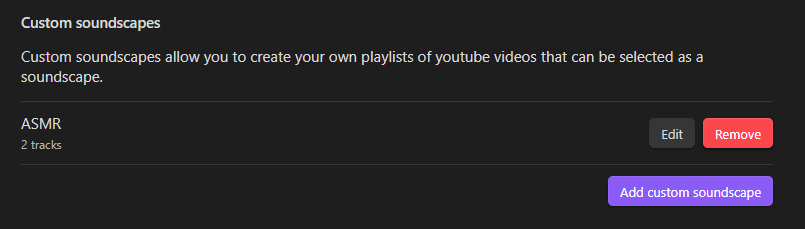
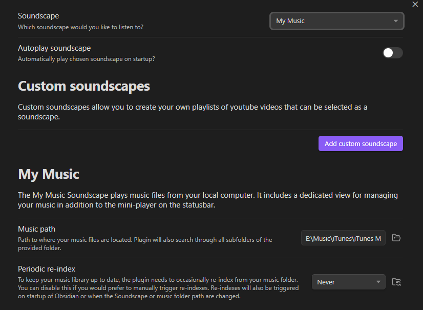
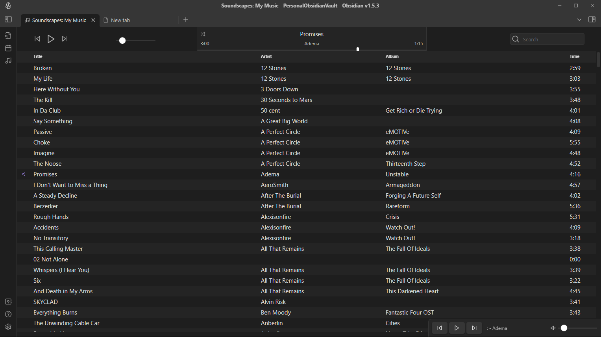

# Obsidian Soundscapes

A plugin for Obsidian.MD that adds a music/ambiance player to the status bar to play Lofi beats, nature sounds, ambiance, relaxing music, and more.

## How to Install

Plugin can be [installed via the official community plugins](https://obsidian.md/plugins?id=soundscapes).

## How to Use

In the settings screen you can select which Soundscape you would like to play and whether or not it should play on launch of Obsidian. As pictured above, the player and it's controls are displayed in the status bar. Volume can be set and is remembered between launches of Obsidian.

### Custom Soundscapes

A custom soundscape is a playlist of youtube links that you can customize to create your own ambiance. These are created within the settings screen. You can create as many custom soundscapes as you want and each custom soundscape can have as many tracks as you want.

Additionally, when listening to a custom soundscape, you can use the new "next" and "previous" buttons to switch tracks.

### My Music - Local Music Library

The "My Music" soundscape allows you to have a full music player experience right within Obsidian using your local MP3 music files. Upon selecting your local music folder, the plugin will index your music and occasionally re-index it in the background.

My Music supports playing with the mini-player in the status bar as well as a new dedicated My Music view with a new icon on the Ribbon sidebar once the "My Music" soundscape is selected. You can close this view and the music will continue playing.

Within the My Music view, you can play, pause, next, previous, seek, shuffle, and search.

## Requesting New Soundscapes

Have an idea for a new Soundscape? [Open an issue](https://github.com/andrewmcgivery/obsidian-soundscapes/issues/new) and link a Youtube video and why we should add it!

## External Resources

This plugin makes use of the Youtube IFrame API and includes that script as a result. Youtube videos are loaded in the background.

Additionally, the plugin makes a call to this github repository occasionally to check if there is a new version.

## Credits

-   [Lofi beats](https://www.youtube.com/watch?v=jfKfPfyJRdk)
-   [Spa atmosphere](https://www.youtube.com/watch?v=luxiL4SQVVE)
-   [The Sims complete soundtrack](https://www.youtube.com/watch?v=wKnkQdsITUE)
-   [Thunderstorm](https://www.youtube.com/watch?v=nDq6TstdEi8)
-   [Cozy fireplace](https://www.youtube.com/watch?v=rCYzRXLWcIg)
-   [Birds chirping](https://www.youtube.com/watch?v=mFjU4JuJgnM)
-   [Ocean waves](https://www.youtube.com/watch?v=bn9F19Hi1Lk)
-   [Relaxing jazz](https://www.youtube.com/watch?v=tNvh2w8lTes)
-   [Coffee shop ambience](https://www.youtube.com/watch?v=uiMXGIG_DQo)
-   [Animal Crossing New Horizons](https://www.youtube.com/watch?v=zru-TLye9jo)
-   [Calm Nintendo music](https://www.youtube.com/watch?v=sA0qrPOMy2Y)
-   [Yakuza/Like a Dragon bar ambience](https://www.youtube.com/watch?v=Q0GtyZbHJDM)
-   [Sky: Children of the Light soundtrack](https://www.youtube.com/watch?v=87etrUp83Yc)
-   [Vampire: The Masquerade – Bloodlines Ambient Playlist](https://www.youtube.com/watch?v=pCZxb43L_Ag)

## Reporting Issues

If you run into any issues with this plugin, please [open an issue](https://github.com/andrewmcgivery/obsidian-soundscapes/issues/new) and include as much detail as possible, including screenshots.

# Leave a Tip

