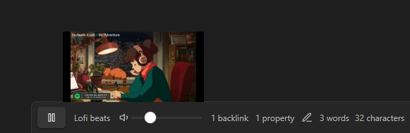
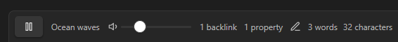

# Obsidian Soundscapes

A plugin for Obsidian.MD that adds a music/ambiance player to the status bar to play Lofi beats, nature sounds, ambiance, relaxing music, and more.

## How to Install

Plugin can be [installed via the official community plugins](https://obsidian.md/plugins?id=soundscapes).

## How to Use

In the settings screen you can select which Soundscape you would like to play and whether or not it should play on launch of Obsidian. As pictured above, the player and it's controls are displayed in the status bar. Volume can be set and is remembered between launches of Obsidian.

## Requesting New Soundscapes

Have an idea for a new Soundscape? [Open an issue](https://github.com/andrewmcgivery/obsidian-soundscapes/issues/new) and link a Youtube video and why we should add it!

## External Resources

This plugin makes use of the Youtube IFrame API and includes that script as a result. Youtube videos are loaded in the background.

## Credits

-   [Lofi beats](https://www.youtube.com/watch?v=jfKfPfyJRdk)
-   [Spa atmosphere](https://www.youtube.com/watch?v=luxiL4SQVVE)
-   [The Sims complete soundtrack](https://www.youtube.com/watch?v=wKnkQdsITUE)
-   [Thunderstorm](https://www.youtube.com/watch?v=nDq6TstdEi8)
-   [Cozy fireplace](https://www.youtube.com/watch?v=rCYzRXLWcIg)
-   [Birds chirping](https://www.youtube.com/watch?v=mFjU4JuJgnM)
-   [Ocean waves](https://www.youtube.com/watch?v=bn9F19Hi1Lk)
-   [Relaxing jazz](https://www.youtube.com/watch?v=tNvh2w8lTes)
-   [Coffee shop ambience](https://www.youtube.com/watch?v=uiMXGIG_DQo)
-   [Animal Crossing New Horizons](https://www.youtube.com/watch?v=zru-TLye9jo)
-   [Calm Nintendo music](https://www.youtube.com/watch?v=sA0qrPOMy2Y)
-   [Sky: Children of the Light soundtrack](https://www.youtube.com/watch?v=6GmL_DKR4fo)

## Reporting Issues

If you run into any issues with this plugin, please [open an issue](https://github.com/andrewmcgivery/obsidian-soundscapes/issues/new) and include as much detail as possible, including screenshots.

# Leave a Tip

